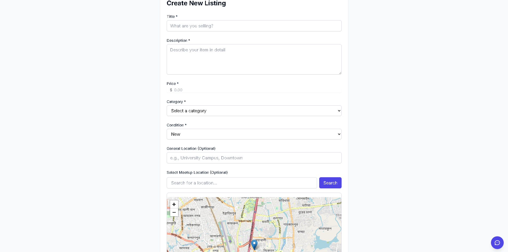

# Student-Driven Marketplace 🎓

A modern, feature-rich marketplace platform specifically designed for students to buy, sell, and exchange items and services within their academic community.

## 📜 Project History

This project was initially created during CodeRush 2025, a prestigious 24-hour hackathon organized by the IUT Computer Society (IUTCS) and the Department of Computer Science and Engineering at Islamic University of Technology. In just one intense day of coding and creativity, our team built the core functionality of this marketplace platform during the intra-IUT ICT fest that brings together talented developers to create innovative solutions.

What started as an ambitious one-day project has since evolved into a fully-featured platform. After the successful demonstration at CodeRush 2025, the platform has been continuously enhanced with additional features, improved security measures, and a more robust architecture to better serve the student community. The current version represents a significant evolution from its hackathon origins, incorporating user feedback and modern development practices.

## 📸 Platform Overview

### User Interface

*Landing page with featured listings and categories*


*Personal dashboard showing user's activities and statistics*

### Marketplace Features

*Browse all listings with advanced filtering options*


*Easy-to-use interface for creating new listings*


*Detailed view of individual listings with all information*

### User Management

*User profile management and settings*


*Real-time messaging system between users*

### AI Features

*AI-powered assistant helping users with their queries*


*Intelligent search system with recommendations*

## 🌟 Features

### Authentication & User Management 🔐
- User Registration with email verification
- Secure Login/Logout system
- Password Recovery System
  - Forgot Password functionality
  - Secure Password Reset
- Comprehensive User Profile Management

[View Detailed Authentication Flow](docs/images/auth-flow.md)

### Core Marketplace Features 📊
- **Listings Management**
  - Browse all listings with filtering options
  - Detailed view for individual listings
  - Create and manage your own listings
  - Edit existing listings
  - Advanced search functionality
- Personal Dashboard for activity tracking
- Profile system with customization options

### Communication System 💬
- **Messaging Platform**
  - Real-time direct messaging between users
  - Listing-specific conversations
  - Message history and management
- Interactive ChatBot for instant assistance
- Notification system for updates and messages

### Search & Discovery 🔍
- Advanced search functionality with filters
- Category-based browsing
- Featured and trending listings
- Personalized recommendations

### Administrative Features 👑
- **Content Management System (CMS)**
  - Content moderation tools
  - Site content management
- **User Management Dashboard**
  - User account administration
  - Permission management
  - Activity monitoring
- **Listing Management**
  - Content moderation
  - Listing approval system
  - Report handling

### User Experience 💫
- Responsive and modern design
- Intuitive navigation
- Mobile-friendly interface
- Quick access to important features
- Seamless user flow

## 🚀 Getting Started

### Prerequisites
- Node.js (v14 or higher)
- npm (v6 or higher) or yarn
- MongoDB (v4.4 or higher)
- Redis (v6 or higher) for session management
- A valid email service account (SendGrid recommended)

### Detailed Installation Steps

1. **Clone the repository**
```bash
git clone https://github.com/yourusername/student-driven-marketplace.git
cd student-driven-marketplace
```

2. **Install dependencies**
```bash
npm install
```

3. **Database Setup**
```bash
# Start MongoDB service
mongod --dbpath /path/to/your/data/directory

# Optional: Seed the database with sample data
npm run seed
```

4. **Environment Configuration**
Create a `.env` file in the root directory:
```env
# Server Configuration
PORT=3000
NODE_ENV=development

# Database Configuration
MONGODB_URI=mongodb://localhost:27017/student-marketplace
REDIS_URL=redis://localhost:6379

# Authentication
JWT_SECRET=your_very_secure_jwt_secret_key
JWT_EXPIRE=7d
COOKIE_EXPIRE=7

# Email Configuration
EMAIL_SERVICE=SendGrid
SENDGRID_API_KEY=your_sendgrid_api_key
EMAIL_FROM=noreply@studentmarketplace.com
EMAIL_FROM_NAME=Student Marketplace

# Cloud Storage (Optional)
CLOUDINARY_CLOUD_NAME=your_cloud_name
CLOUDINARY_API_KEY=your_api_key
CLOUDINARY_API_SECRET=your_api_secret

# Socket.IO Configuration
SOCKET_PORT=3001
```

5. **Start Development Servers**
```bash
# Terminal 1: Start backend server
npm run server:dev

# Terminal 2: Start frontend development server
npm start
```

6. **Build for Production**
```bash
# Build frontend
npm run build

# Start production server
npm run start:prod
```

## 🛠 Technical Details

### Frontend Architecture
- **State Management**: Context API with custom hooks
- **Routing**: React Router v6 with protected routes
- **UI Framework**: Material-UI v7.1.0
- **API Communication**: Axios with interceptors
- **Real-time Features**: Socket.IO client
- **Form Handling**: Custom form hooks with validation
- **Map Integration**: Leaflet with React-Leaflet

### Backend Architecture
- **Server**: Express.js 
- **Database**: MongoDB with Mongoose ODM
- **Authentication**: JWT with refresh tokens
- **Real-time**: Socket.IO server
- **File Upload**: Multer with Cloudinary
- **API Security**: 
  - CORS configuration
  - Rate limiting
  - Request validation
  - XSS protection
  - CSRF tokens

### API Endpoints

#### Authentication
```
POST /api/auth/register
POST /api/auth/login
POST /api/auth/logout
POST /api/auth/refresh-token
POST /api/auth/forgot-password
POST /api/auth/reset-password
```

#### Listings
```
GET    /api/listings
POST   /api/listings
GET    /api/listings/:id
PUT    /api/listings/:id
DELETE /api/listings/:id
GET    /api/listings/search
```

#### Users
```
GET    /api/users/profile
PUT    /api/users/profile
GET    /api/users/:id
PUT    /api/users/:id
DELETE /api/users/:id
```

### Database Schema

#### User Schema
```javascript
{
  username: String,
  email: String,
  password: String,
  role: String,
  profile: {
    firstName: String,
    lastName: String,
    avatar: String,
    bio: String
  },
  listings: [{ type: ObjectId, ref: 'Listing' }],
  createdAt: Date,
  updatedAt: Date
}
```

#### Listing Schema
```javascript
{
  title: String,
  description: String,
  price: Number,
  category: String,
  images: [String],
  location: {
    type: { type: String },
    coordinates: [Number]
  },
  seller: { type: ObjectId, ref: 'User' },
  status: String,
  createdAt: Date,
  updatedAt: Date
}
```

## 👥 Development Team

### Core Team
- **Project Lead & Full-stack Developer**: 
  - Wasi Omar Syed
  - Frontend & Backend Development
  - System Architecture
  - [@WasiOmar](https://github.com/WasiOmar)

- **Frontend Developer**: 
  - Ittesaf Yeasir Ithun
  - Frontend Development
  - UX Architecture
  - [@ithun-y-ittesaf](https://github.com/ithun-y-ittesaf)

- **AI Integration Specialist**: 
  - Muntahi Hasan Akhiar
  - AI/ML Implementation
  - Data Analytics
  - [@hasanakhiar](https://github.com/hasanakhiar)

---

Made with ❤️ for students by students