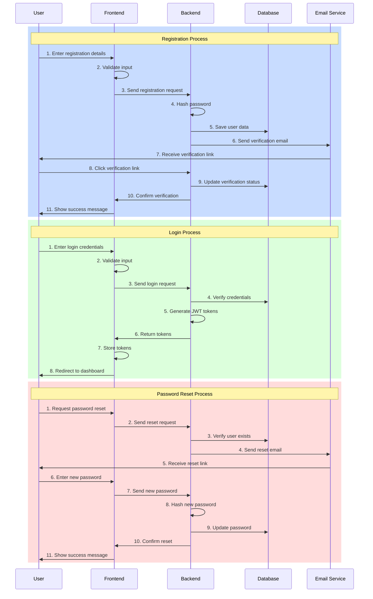

# Authentication Flow

## Authentication Flow Explanation

### 1. Registration Process
1. User enters registration details (email, password, etc.)
2. Frontend validates input format
3. Registration request sent to backend
4. Password is hashed using bcrypt
5. User data saved in MongoDB
6. Verification email sent via SendGrid
7. User receives email with verification link
8. User clicks verification link
9. Backend updates user verification status
10. Frontend confirms verification
11. Success message shown to user

### 2. Login Process
1. User enters email and password
2. Frontend validates input format
3. Login request sent to backend
4. Backend verifies credentials against database
5. JWT access and refresh tokens generated
6. Tokens returned to frontend
7. Tokens stored in secure storage
8. User redirected to dashboard

### 3. Password Reset Process
1. User requests password reset
2. Frontend sends reset request
3. Backend verifies user exists
4. Reset email sent via SendGrid
5. User receives email with reset link
6. User enters new password
7. New password sent to backend
8. New password hashed
9. Database updated with new password
10. Reset confirmed
11. Success message shown to user

## Security Measures

- **Password Security**
  - Passwords hashed using bcrypt
  - Minimum password requirements enforced
  - Password history checked

- **Token Security**
  - JWT tokens with expiration
  - Refresh token rotation
  - Secure token storage

- **Email Security**
  - Verified sender domains
  - Rate limiting on email sends
  - Email template validation

- **API Security**
  - Rate limiting on auth endpoints
  - Input validation and sanitization
  - HTTPS enforced 